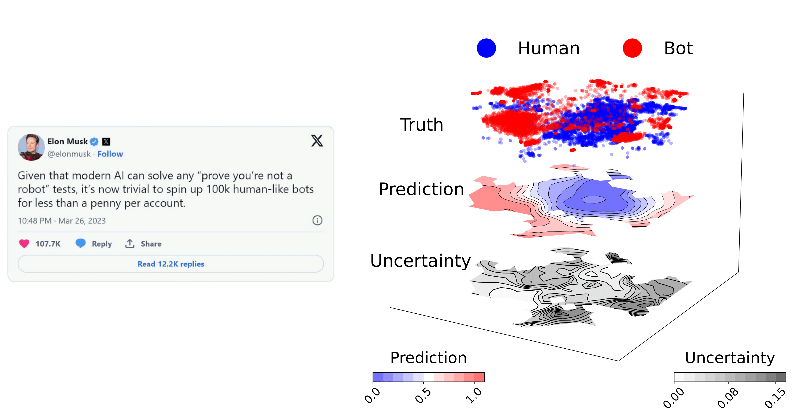
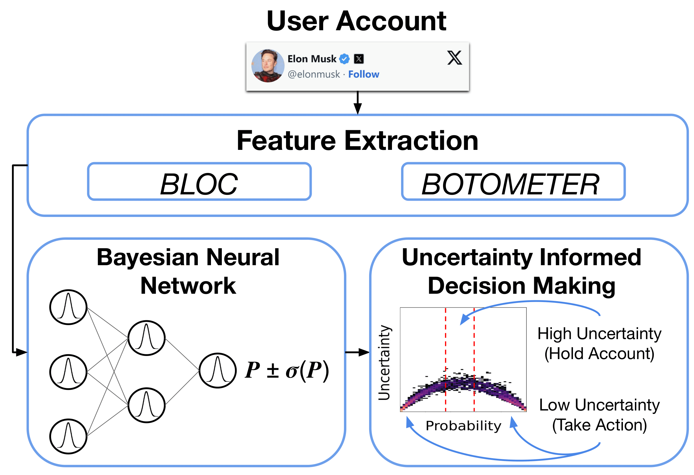

# Unmasking Social Bots: How Confident Are We?

# Abstract 

With the advent of the internet and social media platforms alike, the world has never been in a more connected state. Platforms such as Twitter/X, allow users to share information in real-time. This information, whether mundane day-to-day events, or crucial information regarding natural disasters spreads at a rapid rate. As such, both individuals and organizations with ill intentions have devised methods of spreading misinformation at alarming rates. These attacks generally take the form of Bot Accounts in which automated programs are able to control a large phase space of the social sphere. 
In this paper, we investigate Bayesian deep learning  for classifying bot accounts, showing that our network remains agnostic to the type of input. Our architecture includes uncertainty quantification, offering a more refined approach to decision-making. This capability allows us to assess the confidence of each prediction, thereby enhancing the reliability of our bot detection process. 



# Contents
- [Requirements](#Section-1)
- [Architecture](#Section-2)
- [Usage](#Section-3)
- [BLOC Feature Generation](#Section-4)
    

# Requirements

- Python:     3.9.12
- Pytorch:    1.12.1
- CUDA:       11.3
- [Multiplicative Normalizing Flows](https://github.com/janosh/torch-mnf)
- [BLOC](https://github.com/anwala/bloc)

The dependencies for the networks can be installed with the following command:

```bash
$ conda env create -f requirements.yml
```

In the case that some packages do not install through the provided conda command, you can install them using pip once your conda environment is activated:

```bash
$ python3 -m pip install <package>
```

Note that we have already included the [Multiplicative Normalizing Flows](https://github.com/janosh/torch-mnf) within the models folder. For more information regarding this package please follow the provided links. 

More information regarding the [BLOC](https://github.com/anwala/bloc) dependency can be found in the __BLOC Feature Generation__ section.

# Uncertainty Aware Bot Detection

The Bayesian Neural Network (BNN) is characterized by [Multiplicative Normalizing Flows](https://github.com/janosh/torch-mnf) layers, SELU activation functions and batch norm. The output of the model at inference will be the prediction probability, the epistemic uncertainty and the aleatoric uncertainty. We provide code for the three models used in the paper, BNN, Deep Nerual Network (DNN) and a Random Forest (RF). The DNN and BNN inherit the same structure.




# Usage 

## Training 

Training is configuration file based for all three methods. You will need to create a directory to house the trained models, and update the __default_config.json__ file to reflect this. You will also need to updated where the data files are located. Most hyperparameters can be changed by modifying the fields in this file. The provided config file can be used to train all three models on both datasets, requiring only modification of the __name__ field. We recommend a naming convention such as:
    
`BNN_BLOC , BNN_BOTOMETER, DNN_BLOC, ...,  etc. `
    
You can specify the dataset you wish to train on (Bloc, or Botometer) using the --method field.
    
To train the BNN on Bloc features you can run the following command:
    
```
$ python train_mnf.py --config config/default_config.json --method "BLOC"
```

To train the BNN on Botometer features you can run the following command:
    
```
$ python train_mnf.py --config config/default_config.json --method "BOTOMETER"
```

This will create a folder within the "output/dir" folder of the config file that will be named based on the "name" field of the config file. The weights at each epoch will be saved here for later use.
    
The DNN and RF can be trained using similar commands. For example:
    
```
$ python train_mlp.py --config config/default_config.json --method "BLOC"
```` 

```
$ python train_RF.py --config config/default_config.json --method "BLOC"
```

## Testing

Evaluation of the model will be broken into two steps.
    
1. Production of Inference.csv file.
2. Plotting.
    
Once you have models trained, you will need to provide the relative path to the desired epoch for the three models under the __Inference__ field of the config file. You can then run inference using the BNN using the following command:
    
```
$ python run_inference.py --config config/default_config.json --mlp_eval 1 --method "BLOC"
```

The --mlp_eval arguement controls whether or not we want to evaluate the DNN. By default this is set to 0 (False). The --method field will control which model/dataset will be used.

This will create a folder named according to the __out_dir_BLOC__ or __out_dir_BOTOMETER__ field depending on which method is specified and place the resulting .csv file within.

You can then run plotting and performance analysis with the following command:

```
$ python run_inference.py --config config/default_config.json --mlp_eval 1 --method "BLOC" --comparison 0
```
    
This will produce plots and performance metrics for the BNN and DNN. If you have trained an RF model, you can also include set --comparison 1 to produce the full comparison plots of all three models. The output figures will be placed in the same folder as the Inference.csv file.  
    
Note that the performance of the RF will be produced when you run its training script.

## Additional Plots / Uncertainty Aware Decision Making
    
Additional plots (such as t-SNE) can be created using the __extras.ipynb__ notebook, along with example code for uncertainty aware decision making in which accounts are held for classification based on $|P_{pred} - 0.5| > 3\sigma(P_{pred}).$ 

## BLOC Feature Generation

### Install BLOC

Option 1:
```bash
    $ pip install twitterbloc
```
    
Option 2 (for most recent update):
```bash
    $ git clone https://github.com/anwala/bloc.git
    $ cd bloc/; pip install .; cd ..; rm -rf bloc;
```
    
Option 3 (Install inside Docker container):
```bash
    $ docker run -it --rm --name BLOC -v "$PWD":/usr/src/myapp -w /usr/src/myapp python:3.7-stretch bash
    $ git clone https://github.com/anwala/bloc.git
    $ cd bloc/; pip install .; cd ..; rm -rf bloc;
```

### Feature Generation

Execute the python script: [bloc_processor.py](BlocProcessing/bloc_processor.py) as follows to generate BLOC features for twitter accounts.

```

-d --dataset_path       Path to the dataset directory, required=True
-t --tf_idf_output      Output path for the json.gz file to strore the tf-idf matrix, ex:- tf_idf_mat.json.gz, required=True
-f --features_output    Output path for the csv file to save the BLOC features, ex:- features-bloc.csv, required=True
```

By executing the following command, BLOC features can be generated for the twitter accounts. 

```
python bloc_processor.py -d dataset_path -t tf_idf_mat.json.gz -f features-bloc.csv
```
